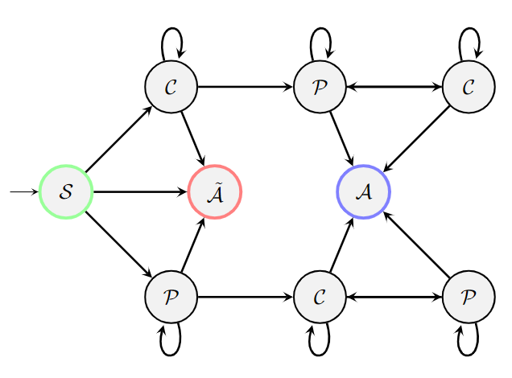

# $\text{WIBA}$
 $\text{An LLM-based Approach For Comprehensive Argument Mining}$
 
 
 
Overview
=============
This repository contains the scripts necessary to create and reproduce the results from our paper, WIBA: An LLM-based Approach for Comprehensive Argument Mining.

### Fine Tuning
-------------
Reference finetune.py

### Blind Eval
-------------
Reference blineval.py and data in /data/ directory.

