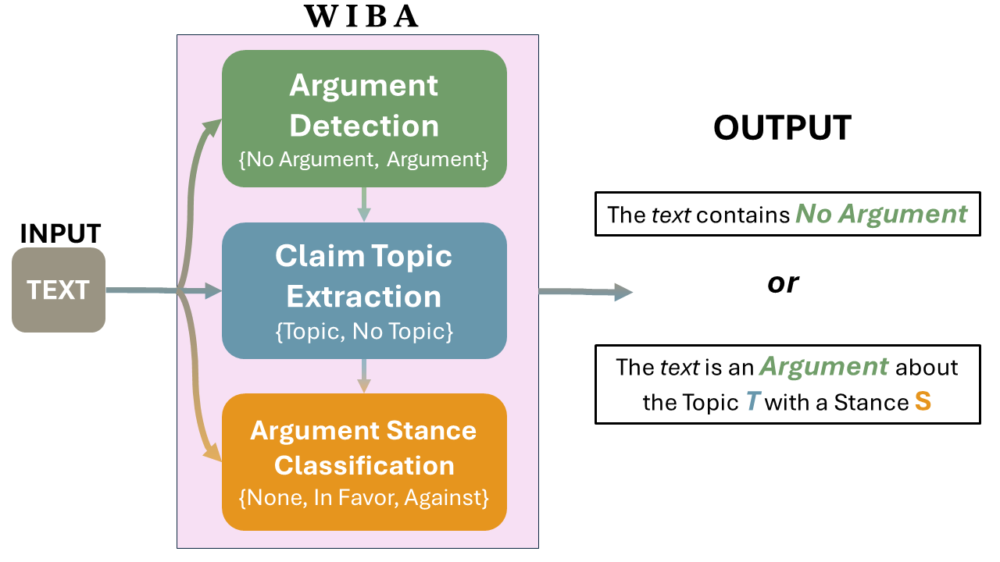
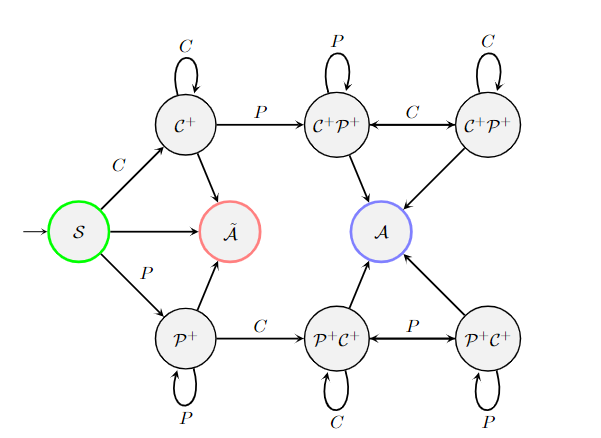
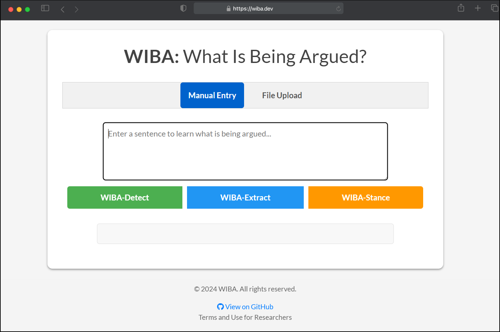
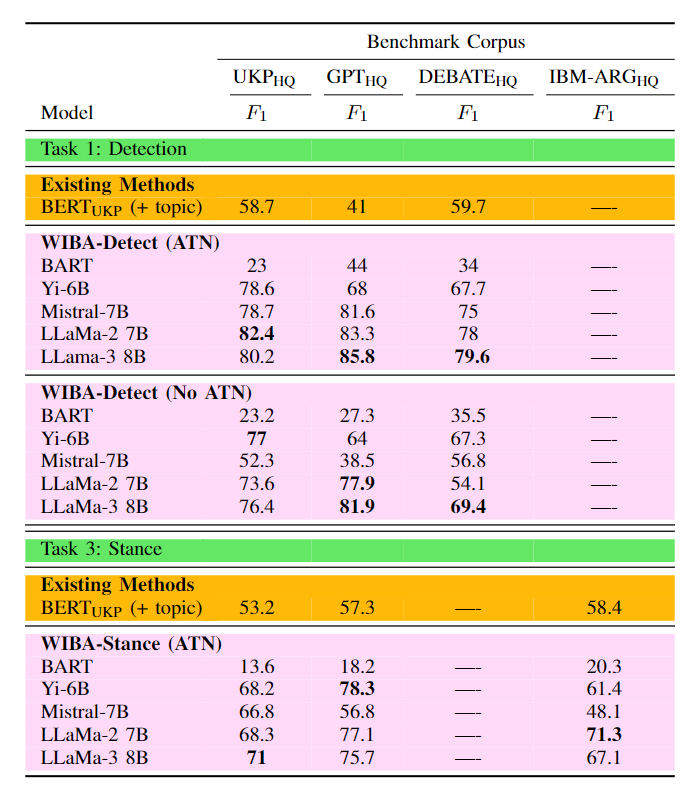

# $\text{WIBA}$
 $\text{What Is Being Argued? A Comprehensive Approach to Argument Mining}$
 <p align="center">
 
 </p>

 ## Table of Contents
1. [Overview](#overview)
2. [Custom Fine-tuning](#custom-fine-tuning)
3. [Out-the-box Usage (HF)](#out-the-box-usage-hf)
   - [WIBA-Detect](#wiba-detect)
   - [WIBA-Extract](#wiba-extract)
   - [WIBA-Stance](#wiba-stance)
5. [WIBA Platform](#wiba-platform)
   - [Submit a bug](#submit-a-bug)
6. [Data](#data)
    - [Blind Eval](#blind-eval)
7. [Paper](#paper)
8. [Authors](#authors)
9. [License](#license)
10. [Acknowledgments](#acknowledgments)
11. [FAQs](#faqs)
12. [Contact Information](#contact-information)
 
### Overview
--------------
This repository contains the scripts necessary to create and reproduce the results from our paper, _WIBA: What Is Being Argued? An LLM-based Approach for Comprehensive Argument Mining._
<p align="center">

</p>


### Custom Fine-Tuning
--------------
```
python3 finetuning.py --training_data "path/to/training/data" --task "argument-classification" --add_data "path/to/additional/data" --llm "model_name" --add_system_message "True" --add_topic "False" --do_train "True" --do_pred "True" --do_eval "True" --test_data "path/to/test/data" --num_epochs 2 --save_model_path "path/to/save/model"
```
#### Arguments
- `--training_data`: Path to the training data files located in /data/finetuning/
- `--task`: Type of task for fine-tuning (`argument-classification` or `stance-classification`).
- `--add_data`: Path to additional data to use during training. (/data/finetuning/add_ibm_arg.csv)
- `--llm`: Name of the pre-trained language model to use (`bart`, `mistral`, `yi`, `llama`, `llama-3`).
- `--add_system_message`: Whether to include WIBA ATN Formalization system messages in the training data (`True` or `False`).
- `--add_topic`: Option to add a Topic to increase contextual data on during training. Default and results from paper is False (`True` or `False`).
- `--do_train`: Flag to indicate if the training should be executed.
- `--do_pred`: Flag to indicate if predictions should be made post-training.
- `--do_eval`: Flag to indicate if evaluation should be performed post-training.
- `--test_data`: Path to the test data file. For argument classification (`ukp_human`, `gpt_pro_all`, `arg_spoken_human`) for stance (`ukp_human`, `gpt_pro_all_stance`, `argqual_stance_human`).
- `--num_epochs`: Number of epochs to train the model. (Default 2)
- `--save_model_path`: Path where the fine-tuned model will be saved.

### Out-the-box Usage (HF)
--------------

```
import torch
from transformers import AutoModelForCausalLM, AutoTokenizer, LlamaForSequenceClassification, BitsAndBytesConfig, pipeline
from datasets import Dataset

bnb_config = BitsAndBytesConfig(
    load_in_4bit=True,
    bnb_4bit_use_double_quant=False,
    bnb_4bit_quant_type="nf4",
    bnb_4bit_compute_dtype=torch.float16)

data = pd.read_csv('/path/to/your/data')
# convert to Dataset object for easier mapping and batching
data = Dataset.from_pandas(data)
```

#### WIBA-Detect
**Note:  LLaMa models are gated. Access their huggingface repo to request a token for access. https://huggingface.co/meta-llama/Meta-Llama-3-8B**

- To use ungated WIBA-detect model with similar performance, replace model path with _"armaniii/mistral-argument-classification"_

Source: https://huggingface.co/armaniii/llama-3-8b-argument-detection
```
model = LlamaForSequenceClassification.from_pretrained("armaniii/llama-3-8b-argument-detection",num_labels=2, torch_dtype.float16,device_map="auto",low_cpu_mem_usage = True, token=YOUR_HF_TOKEN_HERE, quantization_config = bnb_config)
tokenizer = AutoTokenizer.from_pretrained("armaniii/llama-3-8b-argument-detection",use_fast = False)
model.eval()

tokenizer_arg.add_special_tokens({'unk_token': '[UNK]'})
tokenizer_arg.padding_side = "right"
tokenizer_arg.pad_token = tokenizer_arg.unk_token
model_arg.config.pad_token_id = tokenizer_arg.pad_token_id
model_arg.resize_token_embeddings(len(tokenizer_arg))

# Using Pipeline
pipe = pipeline(task="text-classification", model=model_arg, tokenizer=tokenizer_arg,padding=True,truncation=True,device_map="auto",max_length=2048,torch_dtype=torch.float16)

data= data.map(lambda x: {"sentence":[ f"[INST] <<SYS>>\n{system_message_arg.strip()}\n<</SYS>>\n\n" + "Text: '" + sentence +"' [/INST] " for sentence in x['text']]}, batched=True)
inputs = data['sentence']
prompts_generator = (p for p in inputs)
results = []
for out in tqdm(pipe(prompts_generator,batch_size=4)):          
    if out['label'] == 'LABEL_1':
       results.append('Argument')
    else:
       results.append('NoArgument')

data['argument_predictions'] = results
```

#### WIBA-Extract
Source: https://huggingface.co/armaniii/llama-3-8b-claim-topic-extraction
- No ungated model available. Use our platform for access at https://wiba.dev

```
model = AutoModelForCausalLM.from_pretrained("armaniii/llama-3-8b-claim-topic-extraction",torch_dtype.float16,device_map="auto",low_cpu_mem_usage = True, token=YOUR_HF_TOKEN_HERE, quantization_config = bnb_config)
tokenizer = AutoTokenizer.from_pretrained("armaniii/llama-3-8b-claim-topic-extraction",use_fast = False)

tokenizer.pad_token_id = tokenizer.eos_token_id
tokenizer.pad_token_id= 18610
tokenizer.padding_side = "left"

# Using Pipeline
pipe = pipeline('text-generation', model=model, tokenizer=tokenizer,max_new_tokens=8,device_map="auto",torch_dtype=torch.float16,pad_token_id=128009)
data= data.map(lambda x: {"sentence":[ f'<|begin_of_text|><|start_header_id|>system<|end_header_id|>\n\n{system_message_cte.strip()}<|eot_id|><|start_header_id|>user<|end_header_id|>\n\n' + sentence +'<|eot_id|><|start_header_id|>assistant<|end_header_id|>\n\n' for sentence in x['text']]}, batched=True)
inputs = data['sentence']
prompts_generator = (p for p in inputs)
results = []
for out in tqdm(pipe(prompts_generator,batch_size=4)):          
    result=out[0]['generated_text']
    result = result.split("assistant<|end_header_id|>\n\n")[1]
    results.append(result)

data['argument_predictions'] = results
```

#### WIBA-Stance
Source: https://huggingface.co/armaniii/llama-stance-classification
```
model = LlamaForSequenceClassification.from_pretrained("armaniii/llama-stance-classification",num_labels=3, torch_dtype.float16,device_map="auto",low_cpu_mem_usage = True, token=YOUR_HF_TOKEN_HERE, quantization_config = bnb_config)
tokenizer = AutoTokenizer.from_pretrained("armaniii/llama-3-8b-argument-detection",use_fast = False)
model.eval()

tokenizer_arg.add_special_tokens({'unk_token': '[UNK]'})
tokenizer_arg.padding_side = "right"
tokenizer_arg.pad_token = tokenizer_arg.unk_token
model_arg.config.pad_token_id = tokenizer_arg.pad_token_id
model_arg.resize_token_embeddings(len(tokenizer_arg))

# Using Pipeline
pipe = pipeline(task="text-classification", model=model_arg, tokenizer=tokenizer_arg,padding=True,truncation=True,device_map="auto",max_length=2048,torch_dtype=torch.float16)

data= data.map(lambda x: {"sentence":[ f"[INST] <<SYS>>\n{system_message_arg.strip()}\n<</SYS>>\n\n" + "Target: '" + topic +"' Text: '" +inputs  + "' [/INST] " for topic,inputs in zip(x['topic'],x['text'])]}, batched=True)
inputs = data['sentence']
prompts_generator = (p for p in inputs)
results = []
for out in tqdm(pipe(prompts_generator,batch_size=4)):          
    if out['label'] == 'LABEL_0':
       results.append('No Argument')
    elif out['label'] == 'LABEL_1':
       results.append('Argument in Favor')
    else:
       results.append('Argument Against')
data['argument_predictions'] = results
```

### WIBA Platform
-------------

<p align="center">

</p>

Access, for free, the WIBA toolkit at https://wiba.dev. For WIBA-Detect & WIBA-Extract tasks, upload a .csv file with a column you want to analyze named `text`. For WIBA-Stance, you must also have an additional column with the topic information, named `topic`. Current limit for file-sizes are unknown, and processing time is around 8-10 rows/sec, so some manual calculation for time-to-completetion is necessary. Common errors will be caught and announced on the screen. Consider using the Manual Entry section as a playground to get an idea of WIBAs capabilities.

#### Submit a bug
wiba.dev is still under development and is not perfect. If you find a bug or have any suggestions, please email me at airan002@ucr.edu. We will do our best to fix any issues ASAP. 
- Adding a progress bar is currently under development.

### Data
-------------
#### Blind Eval
To reproduce our blind evaluation: 
Reference blineval.py and data in /data/ directory, or run the following script:
```
python3 blind_eval.py --do_ukp --do_debate --do_ibm_arg
```
#### Arguments
- `--do_ukp`: Conduct Blind Evaluation on UKP dataset (Bool)
- `--do_debate`: Conduct Blind Evaluation on DEBATE dataset (Bool)
- `--do_ibm_arg`: Conduct Blind Evaluation on IBM-Arg dataset (Bool)

### Paper
-------------

#### Evalution

<p align="center">

</p>


### Authors

### License

### Acknlowedgments

### FAQ

### Contact Us
